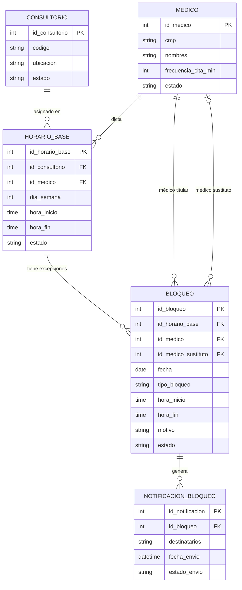

# Caso propuesto: Gestión de Consultorios Médicos — OrtoCentro

## 1. Contexto del negocio

**OrtoCentro** es un consultorio privado especializado en traumatología que cuenta con **8 consultorios médicos**, cuya asignación se controla actualmente mediante una hoja de cálculo Excel (una pestaña por día de la semana). Este método manual dificulta el control de disponibilidad, la gestión de ausencias de médicos y la comunicación oportuna de cambios.

Se requiere diseñar una base de datos que permita:
- Registrar el horario base (recurrente) de atención de cada consultorio y médico.
- Gestionar bloqueos o excepciones cuando un médico avisa que no asistirá.
- Registrar si el consultorio queda libre o si otro médico lo cubre como sustituto.
- Dejar trazabilidad de las notificaciones enviadas por correo ante cada bloqueo.

Este sistema es independiente del sistema de citas de pacientes del consultorio. Aquí solo se controla la disponibilidad de consultorios y médicos, no las citas en sí.

## 2. Alcance del proyecto

Se considerará únicamente información relacionada con:
- Consultorios.
- Médicos.
- Horario base semanal (recurrente).
- Bloqueos / excepciones sobre el horario base.
- Sustituciones de médicos ante un bloqueo.
- Notificaciones enviadas por bloqueo.

Se excluyen del alcance: citas de pacientes, historias clínicas, facturación/honorarios médicos, especialidades adicionales y turnos administrativos no relacionados con consultorios.

## 3. Reglas de negocio

- OrtoCentro opera 8 consultorios, de lunes a viernes de 7:00 a 19:00, y sábados de 8:00 a 12:00.
- Cada médico tiene una frecuencia de cita propia (15, 20, 25 o 30 minutos; la mayoría usa 25).
- El horario base se repite semana a semana por día de la semana (no por fecha específica).
- Nunca puede haber dos médicos asignados al mismo consultorio en el mismo día de semana y rango horario (horario base).
- Cuando un médico avisa que no asistirá, se registra un **bloqueo** sobre una fila del horario base, indicando si es el turno completo o solo parte de él (rango de horas), y el motivo.
- Un bloqueo puede tener un médico sustituto asignado (opcional); si no hay sustituto, el consultorio queda libre ese lapso.
- Cada bloqueo debe generar una notificación por correo informando qué médico no asistirá, el motivo, y si es turno completo o parcial.

## 4. Modelo conceptual

## 5. Modelo lógico

| Tabla | Columnas clave | Relaciones |
|---|---|---|
| `medicos` | id_medico (PK), cmp (UK), nombres, frecuencia_cita_min, estado | Padre de `horario_base` y `bloqueos` |
| `consultorios` | id_consultorio (PK), codigo (UK), ubicacion, estado | Padre de `horario_base` |
| `horario_base` | id_horario_base (PK), id_consultorio (FK), id_medico (FK), dia_semana, hora_inicio, hora_fin, estado | Hijo de `medicos` y `consultorios`; padre de `bloqueos` |
| `bloqueos` | id_bloqueo (PK), id_horario_base (FK), id_medico (FK), id_medico_sustituto (FK, nullable), fecha, tipo_bloqueo, hora_inicio, hora_fin, motivo, estado | Hijo de `horario_base` y `medicos`; padre de `notificaciones_bloqueo` |
| `notificaciones_bloqueo` | id_notificacion (PK), id_bloqueo (FK), destinatarios, fecha_envio, estado_envio | Hijo de `bloqueos` |

**Normalización:** las tablas están en 3FN — no hay grupos repetitivos, cada atributo no clave depende completamente de la clave primaria, y no hay dependencias transitivas (por ejemplo, el nombre del médico no se repite en `bloqueos`, sino que se accede vía `id_medico`).

## 6. Requerimientos de análisis que el modelo debe responder

- ¿Qué médico atiende en qué consultorio, día y horario?
- ¿Cuántos bloqueos ha tenido cada médico en un período?
- ¿Qué consultorios quedaron sin cobertura (bloqueo sin sustituto) en un rango de fechas?
- ¿Qué médicos han actuado como sustitutos y con qué frecuencia?
- ¿Se enviaron todas las notificaciones correspondientes a los bloqueos registrados?
- ¿Qué consultorio tiene mayor tasa de bloqueos (menor disponibilidad efectiva)?

## 7. Modelo físico

Ver script DDL en `modelo_fisico_ortocentro_consultorios.sql` (MySQL).
